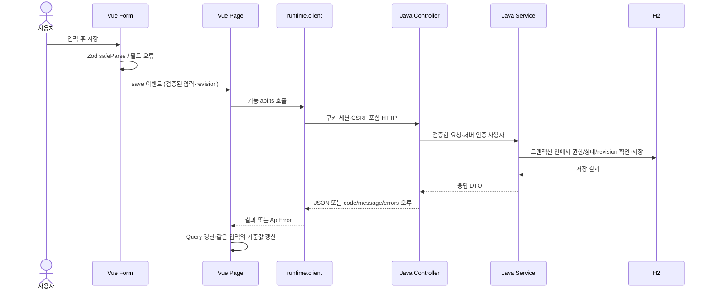

# JSP·Java 개발자를 위한 코드 읽기와 주석 기준

이 문서는 ScFramework의 실제 파일을 따라 Vue 3·TypeScript와 Java 서버를 함께 읽는 안내서다. 프런트와 Java 서버의 모든 수작업 화면·기능 코드에 한국어 설명을 유지한다. 문법 번역보다 **역할, 상태의 주인, 호출 순서, 예외 처리 이유**를 설명한다.

## 먼저 읽을 순서

1. [Starter 시작 화면](../frontend/apps/starter-app/src/StartPage.vue): `ref`, `v-model`, `useQuery`, 이벤트의 가장 작은 예제.
2. [공통 입력](../frontend/packages/ui/src/ScTextField.vue): 읽기 전용 props와 `update:modelValue` 이벤트.
3. [폼 예제](../frontend/apps/starter-app/src/features/patterns/PatternForm.vue): VeeValidate 값·오류·dirty와 Zod `safeParse`.
4. [중립 CRUD 화면](../frontend/apps/reference-app/src/features/examples/ExamplesPage.vue) → [API](../frontend/apps/reference-app/src/features/examples/api.ts) → [서버 패키지](../backend/reference-app/src/main/java/dev/scframework/reference): 한 요청의 왕복.
5. [요구사항 폼](../frontend/apps/reference-app/src/features/requirements/RequirementForm.vue) → [작업 공간](../frontend/apps/reference-app/src/features/requirements/RequirementWorkspace.vue) → [API](../frontend/apps/reference-app/src/features/requirements/api.ts) → [Controller](../backend/reference-app/src/main/java/dev/scframework/reference/requirements/RequirementController.java) → [Service](../backend/reference-app/src/main/java/dev/scframework/reference/requirements/RequirementService.java): 권한·revision·충돌·저장 후 갱신.
6. [공통 HTTP](../frontend/packages/runtime/src/http.ts)와 [runtime 조립](../frontend/packages/runtime/src/runtime.ts): 세션·CSRF·30초 timeout·이전 세션 응답 폐기.
7. [생성 앱 Notes](../templates/starter-v2/frontend/src/features/notes/NotesPage.vue): 독립 앱을 만들 때 가져가는 주석 포함 예제. 이 앱의 backend는 같은 템플릿 안에 있다.

전체 디렉터리 책임은 [구조 문서](folder-structure.md), 실제 API는 [API 계약](api.md), 실행은 [운영 문서](operations.md)를 따른다.

## JSP와 Vue의 실행 위치

JSP는 서버 요청을 받아 HTML을 만들어 보낸다. 이 프로젝트의 Vue는 브라우저에서 실행하며 입력이나 조회 결과가 바뀌면 필요한 화면을 갱신한다. Java 서버는 JSON과 인증된 파일 API를 제공한다. Vue Router의 화면 이동이 곧 Spring Controller 호출인 것은 아니다.

위 흐름은 부모 Page와 자식 Form을 나눈 업무 화면의 대표 패턴이다. 작은 예제는 한 SFC에 둘을 합치기도 한다. UI가 버튼을 숨기거나 입력을 검증해도 최종 권한·상태 전이·revision 확인은 Java Service가 수행한다.

## SFC 한 파일 읽기

이 프로젝트는 `<template>` → `<script setup lang="ts">` → `<style>` 순서다.

| 부분                     | 읽는 방법                                                                                                                 |
| ------------------------ | ------------------------------------------------------------------------------------------------------------------------- |
| `template`               | HTML과 공통 컴포넌트 조립. JSP의 태그 사용과 비슷하지만 브라우저 상태에 반응한다.                                         |
| `script setup`           | 컴포넌트 인스턴스의 상태·이벤트 함수·Query·수명 처리. Java 클래스의 필드/메서드와 역할을 비교하되 실행 위치는 브라우저다. |
| `style scoped`           | 해당 컴포넌트에 범위를 제한하는 CSS. 공통 색·여백은 `--sc-*` 토큰을 사용한다.                                             |
| `{{ title }}`            | 값을 텍스트로 표시한다. 일반 보간은 HTML을 실행하지 않는다.                                                               |
| `:disabled="busy"`       | 고정 문자열 대신 표현식 값을 prop에 전달한다.                                                                             |
| `@click="save"`          | 이벤트 발생 시 함수를 호출한다.                                                                                           |
| `@submit.prevent="save"` | 브라우저의 기본 form 전송을 막고 저장 함수를 실행한다.                                                                    |
| `v-model="title"`        | 값 전달과 변경 이벤트를 묶는다. 공통 입력에서는 `modelValue`/`update:modelValue` 계약이다.                                |
| `v-if` / `v-for`         | 조건부 생성과 반복. 반복 `key`는 순서가 바뀌어도 같은 항목을 찾을 안정적인 ID다.                                          |
| `#row-actions="{ row }"` | 자식 표가 제공한 행으로 부모가 버튼을 구성하는 이름 있는 slot이다.                                                        |

`defineProps`는 부모가 넘긴 읽기 전용 입력이다. 자식은 prop을 직접 변경하지 않고 `defineEmits`로 변경 의도를 알린다. `defineSlots`는 삽입 영역의 타입을 설명한다. 공통 UI는 표시·입력 계약을 소유하고 업무 API나 권한 규칙은 앱이 소유한다.

## 상태는 어디에 두는가

| 자료                                 | 원본                           | 실제 예                                     |
| ------------------------------------ | ------------------------------ | ------------------------------------------- |
| 선택 ID·검색 적용값·페이지·정렬      | Router                         | 보고서 URL의 query, 요구사항 상세 ID        |
| 서버에서 읽은 목록·상세·집계         | Vue Query                      | `useQuery`, `queryKey`, `invalidateQueries` |
| 저장 전 제목·본문·필터 초안          | VeeValidate 또는 해당 폼의 ref | 검색 입력 후 적용하기 전 값                 |
| 원본에서 계산 가능한 값              | computed                       | 현재 언어의 열 제목, 버튼 표시 여부         |
| 여러 화면이 실제로 공유하는 상태     | Pinia/runtime                  | 로그인 사용자                               |
| dialog 열림·파일 선택·현재 작업 표시 | 해당 컴포넌트의 ref            | `busy`, `confirmOpen`, `File`               |

`ref("")`는 변경을 Vue가 감지할 수 있는 상자다. script에서는 `title.value`, template에서는 최상위 `title`을 사용한다. `query.data.value`처럼 일반 객체 안의 중첩 ref는 명시적으로 읽는 코드도 있다. `shallowRef`는 값 내부 전체를 반응형으로 감싸지 않아 이미지 DOM 객체나 불변 배열 교체에 사용한다.

`computed`는 계산 결과를 읽는 용도다. `watch`는 값이 바뀔 때 폼 초기화·언어 동기화·자원 정리 같은 부수 효과를 수행한다. `watch`로 Query 결과를 항상 폼에 복사하면 자동 재조회가 작성 중 입력을 지울 수 있다. 업무 폼의 `resetKey`, `basisRevision`, `dirty` 조건을 함께 읽어야 한다.

`queryKey`는 단순 변수 이름이 아니라 캐시 식별자다. 검색 조건이나 선택 ID가 다르면 키도 달라야 한다. 저장 후 `invalidateQueries`는 관련 서버 상태를 다시 확인하라는 뜻이다. Query 자료를 Pinia나 별도 ref에 중복 보관하지 않는다.

## TypeScript에서 먼저 익힐 표현

| 표현                     | 의미·주의점                                                                                               |
| ------------------------ | --------------------------------------------------------------------------------------------------------- |
| `interface`, `type`      | 값의 모양을 컴파일할 때 검사한다. Java 클래스 인스턴스나 실제 입력 검증기를 만들지 않는다.                |
| `string \| null`         | 문자열 또는 값 없음. `null`과 `undefined`를 다르게 쓰는 URL 파서는 그 차이를 주석으로 설명한다.           |
| `unknown`                | 아직 형태를 모르는 외부 값. `instanceof`, 타입 가드, Zod 등으로 확인한 뒤 사용한다.                       |
| `as SomeType`            | 작성자의 타입 단언. 실제 JSON 검증이나 값 변환이 아니다.                                                  |
| `as const`               | 값에서 정확한 리터럴/읽기 전용 tuple 타입을 추론한다. 런타임 `Object.freeze`가 아니다.                    |
| `satisfies SomeType`     | 원래 추론을 유지하며 계약 적합성을 검사한다.                                                              |
| `ScTableColumn<Row>`     | Java 제네릭과 비슷하게 표의 행 타입을 열/콜백에 연결한다.                                                 |
| `Record<string, string>` | 문자열 키와 문자열 값의 맵 타입이다.                                                                      |
| `Page["items"][number]`  | DTO의 items 배열에서 요소 타입을 꺼낸다.                                                                  |
| `?.` / `??`              | null/undefined일 수 있는 값 접근 / null·undefined일 때 기본값 선택. `0`, `false`, `""`는 그대로 유지한다. |
| `!`                      | null/undefined가 아님을 컴파일러에 단언한다. 실제 방어 검사를 추가하지 않는다.                            |
| `async` / `await`        | Promise 완료를 기다리는 흐름이다. 기다리는 동안 사용자가 선택/세션을 바꿀 수 있다.                        |

외부 입력은 `schema.safeParse(value)`의 `success`를 확인한다. 성공한 `data`만 API 입력에 사용하고, 실패한 `issues`를 VeeValidate 필드에 연결한다. 호환 범위 밖의 Zod 어댑터는 추가하지 않는다. OpenAPI 생성 파일은 직접 주석을 편집하지 않고 이를 소비하는 `api.ts`에서 DTO 선택 이유와 사용 흐름을 설명한다.

## 비동기와 revision을 구분해서 읽기

`revision`은 서버의 낙관적 동시 수정 검사 값이다. 입력을 시작한 기준 번호를 저장 요청에 보내고 다른 사용자의 수정과 충돌하면 409를 받는다. 이때 입력을 보존하고 사용자가 최신 자료를 확인하도록 한다.

화면에서 사용하는 작업 `epoch`는 선택/작업 순번이다. A 상세를 조회하는 중 B로 이동했다면 늦게 도착한 A 응답으로 B 폼을 초기화하지 않아야 한다. `client generation`은 로그인 세션의 순번이다. 이전 사용자의 진행 중 응답을 새 로그인 화면에 적용하지 않도록 공통 runtime과 기능의 비동기 후속 처리가 확인한다. 작업 순번·서버 revision·세션 generation은 서로 다른 목적이며 하나로 합치지 않는다. 다만 runtime 내부에서 `epoch`라는 지역 변수는 client generation의 스냅샷을 뜻하기도 하므로 변수명만으로 의미를 판단하지 말고 생성 위치와 비교 대상을 읽는다.

직접 만든 Object URL은 `URL.revokeObjectURL`, 타이머는 `clearTimeout`, 구독은 반환된 해제 함수로 정리한다. Vue 수명의 `onBeforeUnmount`/`app.onUnmount`에서 미완료 작업과 자원 소유권을 끝낸다. VueUse의 수명 정리와 직접 만든 자원의 정리 책임을 구분한다.

## Java 서버에서 주석으로 확인할 경계

| 계층                  | 설명해야 할 내용                                                                                         |
| --------------------- | -------------------------------------------------------------------------------------------------------- |
| Controller            | HTTP 경로/입출력, 서버 인증 사용자 전달, 요청 검증, 응답 상태. 업무 규칙의 소유자는 Service다.           |
| DTO/record            | 프런트와 주고받는 필드, 필수/선택/빈 값, ID·revision·시간의 의미. 성공 JSON을 일괄 봉투로 바꾸지 않는다. |
| Service               | 권한·상태 전이·revision, 트랜잭션 범위, 실패 시 보존/rollback, 감사·파일·메시지와의 관계.                |
| Entity/Repository     | 앱 소유 테이블, 상태 변경 규칙, JPA 조회/쓰기와 잠금·동시성 의도.                                        |
| Querydsl/MyBatis      | 복잡 조회 조건·정렬 허용 목록·집계 범위, 같은 DataSource/트랜잭션 사용.                                  |
| 공통 core/자동 설정   | 소비 앱이 구현/교체할 SPI, 활성 조건과 기본값, 세션·CSRF·오류 계약.                                      |
| 외부 HTTP·메시징·예약 | timeout/오류 매핑, 재시도·중복·ACK·커밋 경계, 허용 작업과 복구 한계.                                     |

JPA 변경은 flush 전까지 SQL에 반영되지 않을 수 있다. 같은 트랜잭션에서 MyBatis로 조회할 때 flush가 필요한 지점을 주석으로 설명한다. flush와 commit은 다르다. H2 DDL의 커밋 경계와 일반 DML rollback도 구분한다. 프런트의 `ApiError.fields`는 서버 `code/message/errors[]`를 공통 client가 변환한 결과다.

## 신규 화면·기능의 필수 주석

파일 첫 설명에는 **무슨 기능인지, 어디서 호출하는지, 주요 입력/출력, 상태나 자료를 누가 소유하는지**를 적는다. 긴 함수는 검증→요청→성공 갱신→오류→정리 경계마다 이유를 설명한다. Vue template에는 폼·목록·상세·대화상자 등 의미 있는 영역의 데이터/이벤트 연결을 설명한다. 화면 개요는 script 주석에 두고, HTML 영역 주석은 기존 루트 요소 안에 둔다. template 최상위에 형제 주석을 추가하면 개발 모드에서 단일 루트가 Fragment로 바뀔 수 있다. 특히 self-closing 공통 UI에는 형제 HTML 주석을 추가하지 않는다. Java는 클래스 역할과 주요 메서드의 업무·트랜잭션 계약을 Javadoc/블록 주석으로 적는다.

복잡한 타입·watch 조건·revision·epoch·flush·retry 금지처럼 생략하면 실수하기 쉬운 지점에 설명을 둔다. 모든 대입문에 “값을 넣는다”를 반복하거나 존재하지 않는 보장을 적지 않는다. 코드 변경 때 주석도 함께 검토한다. 실제 비밀번호·토큰·사용자 자료는 예제 주석에 넣지 않는다.

검토 시 다음을 확인한다.

- 처음 읽는 JSP·Java 개발자가 UI 이벤트에서 API와 서버 Service까지 따라갈 수 있는가?
- props/emit, Router/Query/form 상태, TypeScript 타입과 실제 검증을 구분했는가?
- 정상 처리 외에 필드 오류·401/403·409·늦은 응답·자원 해제도 설명했는가?
- 예제 로컬 상태와 실제 서버 저장을 명확하게 설명했는가?
- 설명이 현재 구현과 일치하고 기존 주석과 불필요하게 중복되지 않는가?

현재 수작업 프런트·Java production 코드와 v2 생성 템플릿이 적용 범위다. 자동 생성 타입/Q 클래스, build 출력, 외부 라이브러리, 과거 버전 보존용 `starter-v1`, 테스트·Storybook 시나리오 파일의 전면 재주석은 제외한다. 실제 카탈로그 화면을 구성하는 fixture에는 설명을 추가한다. 검증 결과와 정확한 파일 목록은 [상세 주석 적용 기록](질의/상세주석-개발자학습가이드.md)에 남긴다.
