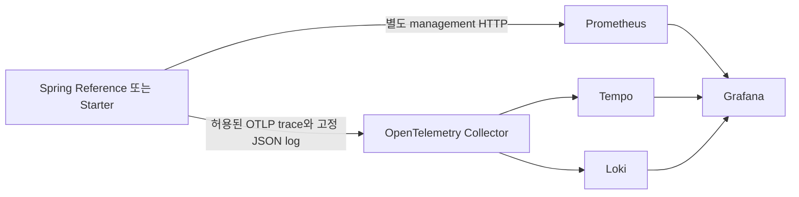

# 012 관측과 컨테이너 계약

관측 모듈과 격리한 Docker Reference 앱은 아래 범위에서 실제로 검증했다. 전체 012 단계의 통합 마감 상태는 [운영 계약](012-운영계약.md)과 루트의 최종 근거를 함께 확인한다. 이 문서만으로 원격 CI, Linux 시각 기준 이미지, 수동 음성 접근성, 전원 장애 복구가 완료됐다고 판단하지 않는다.

## 실제 검증 상태

| 범위                    | 실제 결과                                                                                                  | 근거                                                                                                                                  |
| ----------------------- | ---------------------------------------------------------------------------------------------------------- | ------------------------------------------------------------------------------------------------------------------------------------- |
| 관측 전체 경로          | 8개 그룹 PASS, 비밀 canary 일치 0, NDJSON 600                                                              | [fifth JSON](../검증/012-observability-fifth.json), [명령 로그](../검증/012-observability-fifth.log)                                  |
| 분산 trace              | 실제 SERVER 조상 → Feign CLIENT 연결, 6 spans                                                              | 위 관측 JSON의 `collector-tempo-actual-server-client-trace`                                                                           |
| 메트릭                  | JVM·Hikari·HTTP count/histogram·고정 운영 이벤트, 실제 scrape UP                                           | 위 관측 JSON의 `prometheus-live-scrape-jvm-hikari-http-histogram-and-bounded-events`                                                  |
| 안전한 운영 로그        | Collector → Loki, 실제 trace와 상관된 로그 조회                                                            | 위 관측 JSON의 `collector-loki-actual-safe-log-trace-correlation`                                                                     |
| Grafana API·브라우저    | 실제 datasource 3개, 패널 6개, 성공 query 6개, data frame 11개, 값이 채워진 metric query 5개, page error 0 | [브라우저 summary](../검증/012-grafana-browser-second/summary.json), [실제 화면](../검증/012-grafana-browser-second/grafana-1440.png) |
| Linux arm64 앱 이미지   | Docker third build SUCCESS, 총 196개 중 실제 193개 실행·3개 MQ 조건부 skip                                 | [빌드 로그](../검증/012-docker-app-build-third.log)                                                                                   |
| native 전체 서버 테스트 | 196 PASS, failure/error/skip 0. 실제 Rabbit 및 자식 JVM crash 테스트 포함                                  | [실제 합계](../검증/012-backend-verify-fifth-summary.json), [로그](../검증/012-backend-verify-fifth.log)                              |
| Docker 운영 Reference   | fourth 실제 7개 그룹 PASS                                                                                  | [결과](../검증/012-docker-operations-fourth.json), [로그](../검증/012-docker-operations-fourth.log)                                   |
| portable CLI 경계       | 외부·과도한 project, symlink·public runtime root 4개 거절. 보호 파일 4개 SHA와 task container IDs 불변     | [부정 검증](../검증/012-docker-portable-gates.json)                                                                                   |
| 사용 이미지             | 6개 digest 고정 이미지 pull·Linux arm64 확인                                                               | [actual pull](../검증/012-images-pulled-second.json)                                                                                  |
| upstream 고지           | 정확한 버전 태그의 LICENSE·NOTICE 계열 원문 11개 보존, URL·Git blob SHA·SHA-256 기록                       | [원문 안내](../../infra/operations/third-party/README.md), [inventory](../../infra/operations/third-party/inventory.json)             |

Grafana PNG는 루트가 실제로 보고 패널과 표시값을 검토했다. 자동 JSON의 `manualReviewComplete: false`는 수동 검토 결과를 자동 검증기가 기록하지 않았다는 경계다. 수동 VoiceOver 검증 완료를 뜻하지 않는다. Docker 빌드의 MQ skip 3개는 외부 broker 없는 image build 단계의 결과이며 native 서버 196개 전체 실행 증거와 구분한다.

## 관측 데이터의 흐름과 책임



공통 자동 설정은 [ScObservabilityAutoConfiguration.java](../../backend/framework-autoconfigure/src/main/java/dev/scframework/autoconfigure/ScObservabilityAutoConfiguration.java)가 소유한다. 소비 앱은 활성 프로필, runtime root, 별도 management 주소·포트, secret 파일, application 이름을 선택한다. 기본 `sc.framework.observability.enabled=false`이며 두 앱의 `operations` 프로필에서 활성화한다. 사용자 세션·CSRF와 업무 권한은 앱의 기존 서버 계약을 유지한다. Redis·JWT·SSO, Grafana 유료 기능·Cloud 계정·외부 오류 수집 계정은 사용하지 않는다.

[Collector 설정](../../infra/operations/collector.yml)은 OTLP HTTP/gRPC를 내부 네트워크에서 수신한다. trace는 Tempo, log는 Loki로 보낸다. `memory_limiter` 128 MiB·spike 32 MiB, batch 128, exporter queue 1,000, 전송 timeout 3초·유한 retry window 30초를 둔다. 이 관측 큐는 메시지 업무 outbox의 영속성과 역할이 다르며, 관측 자료의 무손실 저장을 보장하지 않는다. 업무 메시지·감사·파일 복구는 [메시지와 복구 계약](012-메시지와복구계약.md)을 따른다.

## trace와 metric 공개 경계

[SafeSpanExporter.java](../../backend/framework-autoconfigure/src/main/java/dev/scframework/autoconfigure/observability/SafeSpanExporter.java)는 exporter에 보내기 직전에 원 span을 허용된 필드로 다시 작성한다.

| 입력·출력          | 실제 정책                                                                                                                       |
| ------------------ | ------------------------------------------------------------------------------------------------------------------------------- |
| HTTP method        | `http.request.method` → `http.method` → Micrometer `method` 순으로 읽고, 등록된 HTTP method만 `http.request.method`로 출력      |
| HTTP status        | semantic numeric status 또는 Micrometer 100~599 문자열 `status`를 숫자 `http.response.status_code`로 출력                       |
| route              | `http.route` 또는 Micrometer `uri` 중 현재 MVC에 등록된 pattern만 `http.route`로 출력. 실제 ID·query가 붙은 URL은 출력하지 않음 |
| error              | span의 ERROR 여부만 고정 `error.type=ERROR`, status description은 빈 문자열                                                     |
| span 이름·resource | 고정 `SC SERVER`/`SC CLIENT` 등 kind 이름, 검증한 `service.name`만 사용                                                         |
| event/link/scope   | events·links·원 scope metadata 제거, scope는 `sc-framework`                                                                     |
| 상관 관계          | span/trace ID와 부모 연결을 유지해 SERVER → CLIENT 관계 조회                                                                    |
| 금지 자료          | raw SQL, URL, query, exception message/stack, baggage, 사용자 입력, cookie/session/token/password                               |

Collector의 transform processor에서도 resource와 span attribute allowlist를 다시 적용한다. log attributes는 비운다. 임의 application log나 일반 Throwable를 Collector에 전달하는 appender는 붙이지 않는다. Micrometer HTTP·Feign metric의 URL 계열 tag는 등록 pattern 또는 `OTHER`, exception/error tag는 `none` 또는 `ERROR`로 제한한다. 공통 운영 metric `sc.operations.events`의 label은 고정 enum `kind`/`outcome`이며 event ID·사용자·요청 URL을 label로 만들지 않는다. 소비 앱이 새 metric/exporter를 등록하면 그 새 자료의 cardinality와 원문 노출도 별도로 검토한다.

Feign 전파는 실제 loopback success/HTTP error/read timeout 3경로에서 확인했다. 6 spans의 SERVER 조상과 CLIENT 연결, Tempo 조회와 Loki trace 상관을 실제 확인했으며, 관측 canary scan의 secret 일치는 0이었다. 이것은 이번 합성 입력과 실제 수집 결과의 근거이며 모든 미래 입력에 대한 포괄적인 비노출 증명으로 확대하지 않는다.

## 고정 JSON 로그와 실패 처리

[SafeOperationalEventSink.java](../../backend/framework-autoconfigure/src/main/java/dev/scframework/autoconfigure/observability/SafeOperationalEventSink.java)는 `OperationalEvent`의 고정 enum을 받아 아래 JSON만 생성한다.

```json
{
  "timestamp": "2026-10-07T00:00:00Z",
  "kind": "HTTP_REQUEST",
  "outcome": "SUCCESS"
}
```

실제 event에 UUID가 있으면 `eventId`, 현재 trace가 있으면 `traceId`/`spanId`를 추가한다. 원문 message, stack, body, actor 정보, 파일 경로는 받지 않는다. 이 고정 JSON만 별도 SDK logger로 OTLP log에 전송하고 동일 내용을 mode 600 NDJSON 파일에 쓴다. `application.log` 전체를 Loki로 보내지 않는다. HTTP filter는 observation 안쪽에서 고정 SUCCESS/FAILURE 이벤트만 생성한다.

NDJSON 기본 한도는 10 MiB이며 지원 범위는 4 KiB~100 MiB다. 한도 초과 시 `.1`~`.3` 세 백업으로 순환한다. write·rotation 경계에서 symlink와 non-regular 파일을 거절한다. 기본 sink가 포착한 동기 IO·직렬화·emit 예외는 업무 결과를 바꾸지 않고 `sc.operations.observability.failures` counter에 반영한다. 호출부는 교체 sink의 RuntimeException도 업무 결과에서 분리한다. 비동기 exporter 장애가 이 counter에 모두 집계된다고 주장하지 않는다. SDK batch queue는 2,048개, batch 128개, interval 500 ms다. Collector·Tempo·Loki 장애 때 이 관측 queue/log를 업무 감사의 durable delivery로 대체해서 해석하지 않는다.

| 설정                                 | 기본·활성 프로필의 실제 책임                                                                                       |
| ------------------------------------ | ------------------------------------------------------------------------------------------------------------------ |
| `sc.framework.observability.enabled` | 기본 false, operations true                                                                                        |
| `otlp-endpoint`                      | 기본 `http://127.0.0.1:4318/v1/traces`; operations native 기본 4319, Docker 내부 `http://collector:4318/v1/traces` |
| `event-log`                          | 활성 앱이 `${SC_HOME}/logs/operations.ndjson` 절대 경로 제공                                                       |
| `observer-secret-file`               | 활성 앱의 private configtree `observer.secret`, 값은 코드·문서·stdout에 없음                                       |
| `max-log-bytes`                      | 10,485,760 bytes 기본                                                                                              |
| `management.server.port`             | 활성 native/Docker management 기본 18482, 업무 포트와 분리 필수                                                    |
| `management.server.address`          | native 기본 loopback, Docker 내부 0.0.0.0. Compose에서 management host port 공개 없음                              |
| HTTP histogram·sampling              | operations HTTP histogram 활성, tracing probability 1.0, remote/correlation baggage 목록 비어 있음                 |

표의 `enabled`부터 `max-log-bytes`까지는 `sc.framework.observability` 하위다. management·histogram·sampling은 Spring Boot 설정이다. source는 [properties](../../backend/framework-autoconfigure/src/main/java/dev/scframework/autoconfigure/observability/ScObservabilityProperties.java)와 [Reference operations 프로필](../../backend/reference-app/src/main/resources/application-operations.yml)이다. exporter/sink/logger provider와 이름이 같은 observer chain은 명시 교체 bean으로 backoff한다. 교체 구현의 공개·원문·권한 경계는 그 소비 앱이 검토해야 한다.

## 별도 observer 인증과 Grafana 사용

`/actuator/prometheus`는 **management 실제 local port**에서만 별도 `scObserverSecurityChain`을 적용한다. mode 600 파일을 기존 `SecretFileUsers`의 검증·BCrypt 구현으로 읽는다. `sc-observer` Basic 계정은 stateless이며 business login 세션이나 CSRF를 발급하지 않는다. management와 업무 포트가 같으면 활성화 시 실패한다. 이 chain의 CSRF 비활성은 management Basic scrape 경계에만 적용되며 업무 POST의 세션·CSRF를 유지한다. 실제 인증 경계 5개와 업무 CSRF를 검증했다.

[Prometheus 설정](../../infra/operations/prometheus.yml)은 파일 기반 observer 비밀값으로 native job과 container job을 분리한다. native target은 `host.docker.internal:18482`, container target은 `reference-app:18482`다. `extra_hosts: host.docker.internal:host-gateway`를 사용해 Linux의 host gateway 설정도 명시한다. 현재 실제 실행 환경은 macOS의 Docker Desktop Linux arm64이며 별도 Ubuntu 원격 runner 실행과는 구분한다.

[Grafana datasource provisioning](../../infra/operations/grafana/provisioning/datasources/sc-framework.yml)은 내부 URL의 Prometheus·Tempo·Loki 3개를 읽기 고정한다. [dashboard](../../infra/operations/grafana/dashboards/sc-framework.json)는 request rate, 5xx rate, HTTP p95, heap, 운영 이벤트, 정제 로그 6패널이다. trace ID로 Loki와 Tempo를 연결한다. 익명 로그인·분석 전송은 비활성이고 최초 관리자 secret은 private 파일로 제공한다. 실제 query와 표시 데이터까지 확인했으며 패널 존재만으로 통과 처리하지 않았다.

## Docker 실행과 실제 검증 명령

[Dockerfile](../../Dockerfile)은 Node/npm 프런트 빌드 → JDK 21/Maven `clean verify` → JRE 실행의 세 단계다. runtime의 [entrypoint](../../scripts/docker-entrypoint.sh)는 root로 private 디렉터리·secret만 준비한 뒤 `gosu 10001:10001`로 Java를 실행한다. 실제 PID 1의 UID/GID가 10001이고 `Umask: 0077`임을 확인했다. SC_HOME/data/logs/uploads는 700, bootstrap/broker/observer secret과 H2/runtime lock은 600이다. root 준비 프로세스가 있다는 사실과 앱 Java의 non-root 실행을 구분한다.

[Compose](../../compose.operations.yaml)의 Reference 앱은 선택 `app` 프로필이다. host 업무 port는 loopback 19082, 내부 18082이며 management는 내부 18482다. SC_HOME은 `/app/runtime`, uploads는 `/app/runtime/uploads`이고 프로젝트별 `operations-application` named volume에 속한다. secret은 read-only mount에서 private tmpfs로 복사한다. 앱 이미지에 secret을 COPY하지 않는다. 인프라 host port도 loopback으로 제한한다.

```bash
# 기존 prepare-operations로 만든 자기 private root만 전달한다. secret 값은 인자에 넣지 않는다.
python3 scripts/verify-docker-operations.py \
  --project scframework-012-20261007 \
  --operations-home /absolute/private/operations \
  --report docs/검증/012-docker-operations.json \
  --log docs/검증/012-docker-operations.log
```

실행 전에 같은 프로젝트의 6개 infra가 기동되고 이미지 build가 완료돼야 한다. 검증기는 `which docker`를 사용하고 명시 `DOCKER_HOST` 또는 현재 Docker context를 따른다. 선택 `--docker-config`는 기존 canonical mode 700 task 디렉터리만 받는다. GitHub 환경에 DOCKER_CONFIG가 없으면 임시 700 config를 만들어 finally 삭제한다. `--project`는 `scframework-012-` 뒤 1~40개 소문자·숫자·하이픈만 허용한다. canonical private prepared root, original Workboard root 제외, read-only secret mount, 해당 project label과 runtime volume을 검사한다.

변경 가능한 서비스는 그 프로젝트의 `reference-app` 하나다. `up --no-deps`와 `restart reference-app`만 수행하고 기존 infra 6개는 ID를 전후 비교한다. actual fourth의 7개 그룹은 다음과 같다.

1. private project·named runtime volume·read-only secret config 검증.
2. prod operations·loopback·non-root·umask·600/700·Flyway 7 확인.
3. 실제 DB ADMIN/session/CSRF·capabilities 4·MESSAGE_DEMO COMPLETED·등록 작업 4 확인.
4. PULSE 생성/재개 → pause, revision 증가와 stale resume 409 `REVISION_CONFLICT` 확인.
5. 합성 요구사항·PDF 업로드, mounted uploads에서 원본 bytes·revision 2 확인.
6. 해당 앱만 재시작, H2 상세·revision·PDF bytes·paused schedule·완료 inbox 보존, infra 6개 IDs 불변 확인.
7. observer 미인증 401/인증 200, Prometheus container job 실제 `up=1` 확인.

검증기는 Docker config와 앱 raw log를 메모리에서만 읽고 secret canary를 검사한다. 원문을 stdout·근거 파일에 저장하지 않는다. task Reference 앱과 합성 자료의 volume은 루트의 증거·정리용으로 보존한다. 전원 장애와 일반 배포 자료의 복원을 이 clean restart 검증으로 대신하지 않는다.

## 사용 이미지와 권리 정보

| 서비스                 | 실제 고정 버전     | upstream 권리 원문                | 실제 플랫폼 |
| ---------------------- | ------------------ | --------------------------------- | ----------- |
| RabbitMQ               | `4.3.6-management` | MPL 2.0, 일부 OCF 파일 Apache 2.0 | Linux arm64 |
| Prometheus             | `v3.13.4`          | Apache 2.0 LICENSE·NOTICE         | Linux arm64 |
| Grafana                | `13.2.3`           | AGPLv3 LICENSE·NOTICE.md          | Linux arm64 |
| OTel Collector Contrib | `0.162.0`          | Apache 2.0 LICENSE·NOTICE         | Linux arm64 |
| Tempo                  | `3.1.0`            | AGPLv3 LICENSE                    | Linux arm64 |
| Loki                   | `3.7.8`            | AGPLv3 LICENSE                    | Linux arm64 |

정확한 image SHA-256 digest는 [actual pull JSON](../검증/012-images-pulled-second.json)과 [license inventory](../../infra/operations/third-party/inventory.json)에 있다. 원문은 upstream 정확한 version tag에서 받은 bytes를 유지한다. Tempo·Loki repository root에 별도 NOTICE 파일이 없다는 확인을 기록했고, 가짜 NOTICE를 만들지 않았다. 이 목록은 6개 서비스 upstream root 고지의 inventory다. image OS 패키지·모든 전이 구성품의 완전한 SBOM, Node/Temurin base image 전체 권리 검토, 최종 법률 결론은 포함하지 않는다.

자체 변경은 Compose·private entrypoint·설정·datasource·dashboard이며, 6개 upstream 이미지의 서버 코드를 patch해서 새 배포물을 만들지는 않았다. [Grafana 공식 licensing 설명](https://grafana.com/licensing/)과 각 exact tag의 원문을 함께 보존한다. 서비스 제공·이미지 재배포·upstream 수정 여부에 따라 제공해야 할 source/고지 범위를 실제 배포 형태로 확인해야 하므로 재배포 검토는 아직 체크하지 않는다. Yzen 소스·라이선스·이미지는 사용하지 않았다.

## 초기 실패와 수정 이력

| 기록                                                                  | 확인한 실패와 후속 처리                                                                                                                                                                                                                                                            |
| --------------------------------------------------------------------- | ---------------------------------------------------------------------------------------------------------------------------------------------------------------------------------------------------------------------------------------------------------------------------------- |
| [Docker build first](../검증/012-docker-app-build-first.log)          | `/opt/homebrew/bin/docker` 경로가 없어서 실행 시작 전에 실패. 실제 설치 CLI로 실행                                                                                                                                                                                                 |
| [Docker build second](../검증/012-docker-app-build-second.log)        | builder Python3 부재로 Java↔Python FileLock 테스트 실패. Linux directory size 4096이 rotation 경로로 들어가 non-regular logfile 문제를 놓친 테스트도 실패. builder Python 설치와 write/rotation non-regular 거절을 제품 경계에 반영                                                |
| [Docker build third](../검증/012-docker-app-build-third.log)          | 수정 후 실제 Linux arm64 build SUCCESS, broker 없는 build에서 MQ 3개 skip은 그대로 기록                                                                                                                                                                                            |
| [Docker operations first](../검증/012-docker-operations-first.json)   | 실제 PULSE stale 요청은 409였으나 verifier가 `CONFLICT`를 기대. 기존 정확한 `REVISION_CONFLICT`로 검사만 수정                                                                                                                                                                      |
| [Docker operations second](../검증/012-docker-operations-second.json) | 수정 후 7개 실제 PASS                                                                                                                                                                                                                                                              |
| [Docker operations third](../검증/012-docker-operations-third.json)   | portable CLI 확장 후 restart 뒤 HTTP AssertionError. 당시 정확한 HTTP status를 보존하지 않아 원인을 단정하지 않음. 뒤의 독립 health/login/schedules 확인은 정상                                                                                                                    |
| [Docker operations fourth](../검증/012-docker-operations-fourth.json) | 제품 변경 없이 고정 phase·status-only 실패 진단을 보강하고 같은 task project에서 7개 실제 PASS                                                                                                                                                                                     |
| [관측 first](../검증/012-observability-first.json)                    | verifier는 무인증 observer Basic 요청이 업무 port에서 404일 것으로 기대했으나 form login redirect 뒤 HTML 200이었다. 지표 노출은 없었다. 지표 원문 없음과 실제 ADMIN session의 업무 port 404를 별도로 검사하도록 보강                                                              |
| [관측 second](../검증/012-observability-second.json)                  | Spring Security INTERNAL spans가 SERVER와 Feign CLIENT 사이에 있어 직접 parent가 SERVER라는 검사 조건이 틀렸다. 실제 ancestor chain을 검사하도록 수정. exporter의 raw PII 제거는 유지하고 Micrometer method/status/등록 uri alias를 semantic 속성으로 매핑하는 source·JUnit을 보강 |
| [관측 fourth](../검증/012-observability-fourth.json)                  | Maven clean verify와 검사 동시 실행으로 target JAR가 삭제 중이어서 fixture 준비 RuntimeError. 최종 JAR를 자기 private 디렉터리로 byte copy한 후 fifth 실행                                                                                                                         |
| [관측 fifth](../검증/012-observability-fifth.json)                    | 고정된 JAR로 8개 그룹과 실제 데이터가 채워진 metric 5패널 PASS. 초기 실패를 성공으로 바꾸지 않음                                                                                                                                                                                   |

## 체크와 남은 한계

- [x] 실제 native 서버 196개 전체 테스트와 Rabbit crash 경계 검증.
- [x] trace·metric·정제 log·Grafana의 실제 데이터 흐름과 secret canary 검증.
- [x] 루트의 Grafana PNG 실제 시각 검토. 자동 접근성·수동 음성 검토와 구분.
- [x] Linux arm64 Reference image build와 non-root/private runtime 실제 확인.
- [x] Docker clean restart에서 H2·상세·PDF·예약·inbox 실제 보존.
- [x] project·root 가드 부정 4개와 원문 고지 6제품/11파일 SHA 검증.
- [ ] GitHub 원격 운영 CI 실행과 별도 Ubuntu runner 확인.
- [ ] 수동 VoiceOver 음성·운영 대시보드의 실제 장애 대응 훈련.
- [ ] Linux 시각 baseline 승인과 전원 장애·NFS·다중 replica 운용 검증.
- [ ] AGPL/MPL/Apache 원문을 기준으로 실제 서비스·이미지 재배포·변경 고지 제공 범위 검토.
- [ ] image 전체 OS/transitive SBOM과 base image까지 포함한 배포 권리 검토.

표시한 관측·컨테이너 체크는 위 근거에 한정된다. 전체 012 최종 npm/Maven/JAR/E2E/패키지·생성 앱 검증과 완료 표시는 루트가 관리한다.
