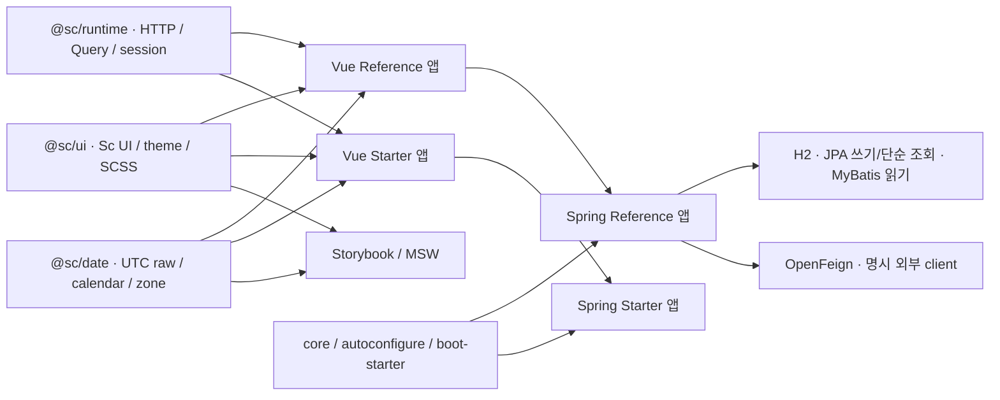

# ScFramework 현재 프레임워크 구성

## 현재: 013 공통 디자인 로컬 검증 완료·사용자 수락 미확인

[013 공통 디자인 프레임워크](013-공통디자인프레임워크.md)는 반복되는 버튼·필터·카드·상태·표 표현을 기존 `Sc` 부품의 공개 계약으로 제공한다. Reference·Starter·Storybook·별도 후보의 로컬 검증을 완료했고 생성 템플릿도 같은 부품을 소비한다. 독립 생성 앱의 설치·타입·빌드·자체 서버·실제 브라우저도 확인했으며 사용자 디자인 수락은 미확인이다. 현재18082 서버는 그대로 유지한다. 실제 결과·검토 후보·새 minor 버전 승격 정책은013이 원본이다. 아래 이전 대시보드 교정의 완료를 전체 공통 디자인 표준의 완료로 합산하지 않는다.

### 이전 기능·대시보드 교정 검증 기록

현재001~012의 기능 구현·로컬 통합 검증을 완료했다. 사용자 지정 Yzen Sales의 시각 목표는 기존 UI가 충족하지 못했으며 별도 [디자인 교정](디자인교정.md)의 로컬 구현·검증을 완료했다. unit149·서버196과 기존 회귀 근거는 기능 단계의 실제 기록으로 유지한다. [새 교정 QA](../검증/design-correction-final-summary.json)는live40check/axe14회 위반0·통합unit155/선별서버10·새JAR관련30개·두JAR/dist해시46/8 일치·원격프리뷰 실제로그인을 확인했다. 현재source공개UI24개와 불변012의22개를 구분한다. 새 시각 기준16PNG의 명시 갱신·정상 비교4개와 전체 Storybook105개/30files도 통과했다. 새패키지 독립 설치소비는 미확인이며 사용자 명시 수락 전 `accepted=false`를 유지한다. 실제 기능 결과와 후속 AI 질의는 [012 완료 기록](012-운영모듈완료.md)과 [최종 집계](../검증/012-final-summary.json)를 따른다.

전체 [Storybook105개/30files](../../.runtime/design-correction/storybook-all-resize-final.log)와 새 [시각 비교4개](../../.runtime/design-correction/visual-baseline-compare.log)가 통과했다. 이전104PASS/1FAIL과 새 기준의 명시 갱신·교정 전17파일 보존은 디자인 교정 문서에 기록했다. 자동 로컬 검증 완료와 사용자 디자인 수락은 구분한다.

공통 패키지 **0.3.0**, 서버 Starter **0.3.0-SNAPSHOT**, 신규 앱 생성 템플릿 **v2**를 기준으로 사용한다. Yzen Sales는 이번 디자인 교정의 명시적인 시각 기준이며 코드·에셋·브랜드·라이선스를 가져오지 않는다. 삼성의 내부 LEGO 구현을 복제한다고 주장하지 않으며 공개 컴포넌트 계약과 조립 가능한 모듈을 제공한다. WorkboardVue 실행 코드·SQLite·실행 자료는 참조용으로 유지한다.

## 앱과 공통 모듈의 책임

| 계층                       | 공통 책임                                                                                      | 소비 앱 책임                                                    |
| -------------------------- | ---------------------------------------------------------------------------------------------- | --------------------------------------------------------------- |
| `@sc/ui`                   | Vuetify 래퍼, 토큰/SCSS, 폼/표/차트/에디터/보드/이미지 공개 props·emits·slots                  | 업무 문구·열 구성·라우트·권한·상태 전이                         |
| `@sc/runtime`              | 단일 HTTP, 30초 timeout, 세션/CSRF, 이전 세션 응답 폐기, Router/Query 연결, 안전한 오류 수집기 | routes·Query key·DTO·Identity decoder·appVersion·등록 routeCode |
| date/i18n/excel            | 날짜·언어·XLSX 중립 adapter                                                                    | 업무 시간대·번역·필드 매핑                                      |
| core/autoconfigure/Starter | 오류·Security·Swagger·Feign·조회 factory·메시지/예약/관측 SPI                                  | UserDetailsService·Entity·DTO·Service·Mapper SQL·handler·DDL    |
| Reference                  | 공통 모듈을 소비하는 실제 업무 예제                                                            | 사용자/권한·요구사항·보고서·파일 등 업무 규칙                   |
| 독립 생성 앱               | 설치된 npm/Maven 산출물만 소비                                                                 | 자체 Notes 업무와 새 기능·Flyway 이력                           |

JPA는 단순 조회·쓰기, Querydsl은 Entity 동적 조건, MyBatis는 복잡 join·집계를 맡는다. 같은 DataSource/트랜잭션을 사용하고 JPA 변경 뒤 Mapper 조회에는 flush를 적용한다. OpenFeign은 서버 외부 HTTP만 담당하며 사용자 쿠키·Authorization·CSRF를 전달하지 않는다. MapStruct는 읽기 DTO, Lombok은 제한된 Getter/생성자에 사용한다.

Vue SFC는 template → script setup TypeScript → style 순서다. URL은 Router, 서버 자료는 TanStack Vue Query, 입력은 폼 로컬 상태, 세션 등 공유 상태는 Pinia가 원본이다. VueUse·VeeValidate 4·Zod 4 safeParse·SCSS·Prettier 설정과 루트 npm lock을 사용한다.

## 네이밍과 공개 계약

직접 만든 공통 UI는 `ScActionButton.vue`/`ScActionButton`, template `<sc-action-button>`, CSS `.sc-action-button`처럼 **sc prefix**를 사용한다. UI 공개 타입도 `ScTextFieldProps`처럼 대응한다. 업무 DTO·API·composable·Entity에는 Sc를 자동으로 붙이지 않는다. 변수/함수는 camelCase, 타입은 PascalCase, 설정 키와 URL은 kebab-case를 기본으로 한다. 이벤트 이름은 save/select/update:modelValue처럼 동작을 드러낸다.

소비 앱은 package의 공개 exports를 사용한다. `src/private` import·workspace 소스 alias·Reference import는 허용하지 않는다. 012 마감 당시 Storybook은 공통 UI22개 공개 문서·Controls10개·기능 play/a11y95개 Story를 확인했다. 이후 대시보드 교정과013의 추가 계약·Storybook 검증은 각 단계에서 구분한다. 자세한 계약은 [UI 공개 계약](UI-공개계약.md), [디자인](디자인.md), [개발가이드](개발가이드.md)를 따른다.

## 운영 모듈과 DB

기본 실행은 messaging/scheduler/browserErrors/observability **OFF**다. 인증된 `/api/framework/capabilities`가 실제 옵션 네 개를 알리며 앱 메뉴·라우트·수집 여부는 이를 조회한다. `dev,operations` 또는 `prod,operations`에서 RabbitMQ·Quartz·Prometheus·OTel Collector·Tempo·Loki·Grafana와 안전한 브라우저 오류 이력을 활성화한다. Redis/JWT/SSO는 제외한다.

DDL은 앱 Flyway가 소유한다. Reference는 기존 V1~V5를 보존하고 운영 V6/V7을 추가한다. 내장 Starter는 audit V1과 운영 V2/V3을 사용한다. 생성 앱 v2는 Notes V1·audit V2와 운영 V3/V4를 사용한다. Quartz 자동 schema 초기화/drop과 Java 객체 JobData는 사용하지 않는다.

메시지는 업무 TX의 H2 outbox, confirm/return 확인, manual ACK, inbox 중복 방지와 유한 재시도로 처리한다. 등록 작업만 Quartz가 실행하고 revision·시간대·misfire·동일 JobKey 비중첩을 검증한다. 백업은 앱을 멈춘 뒤 배타 lock에서 H2+uploads+journal을 같은 세트로 보관하며 동일 JAR SHA의 새 빈 root에 복원한다. 운영 migration을 적용한 DB에서 **0.2로 제자리 downgrade를 지원하지 않는다**. 이전 버전 복귀는 그 버전과 호환되는 백업 복원이 필요하다.

## 사용과 검증

[기술스택 표](기술스택-적용현황.md)는 실제 적용·사용도·필수 여부·버전을, [개발 단계](개발단계.md)는 001~012의 순서와 실제 결과를 관리한다. [운영 계약](012-운영계약.md), [메시지·복구](012-메시지와복구계약.md), [예약·브라우저](012-예약과브라우저오류.md)를 먼저 읽는다. 아래 과거 기록의 숫자는 해당 단계 당시 결과이며 최신 통합 성적과 구분한다.

## 신규 프로젝트를 AI에 요청하는 문장

```text
ScFramework 0.3.0의 검증된 내부 npm/Maven artifact 세트와 starter-v2를 소비하는 새 프로젝트를 생성해줘.
대상은 새 빈 경로이고 기존 프로젝트·DB·uploads·secret을 복사하거나 덮어쓰지 않는다.
공개 exports만 사용하고 Vue SFC/template·sc 공통 UI prefix·루트 npm lock·세션/CSRF를 유지한다.
단순 조회/쓰기는 JPA, Entity 동적 조건은 Querydsl, 복잡 SQL은 MyBatis, 외부 HTTP는 OpenFeign을 사용한다.
Redis/JWT/SSO는 제외한다. 업무 DTO·Service·권한·revision·Flyway는 소비 앱이 소유한다.
필요한 운영 모듈은 기본 OFF로 제공하고 활성 시 private configtree와 앱의 migration/handler를 검증한다.
구현 파일·문서·실제 실행 명령·성공/실패/미확인 결과를 남기고 설치만으로 완료 표시하지 않는다.
```

<details>
<summary>과거 단계의 설계·제안·검증 이력</summary>

# ScFramework의 공통화 구조

ScFramework는 재사용 UI·프런트 runtime·Spring Starter를 조립하는 신규 프레임워크다. 001~006의 중립 모듈·로컬 회귀 기반을 구현·검증했고 007의 사용자·요구사항·날짜·감사 파일럿의 구현·로컬 통합 검증도 완료했다. 삼성 LEGO는 모듈을 조립하는 방향의 비유이며 내부 구현을 확인하거나 복제한 결과가 아니다. [검증 원본](001-프로젝트생성.md), [모듈별 실제 위치](../folder-structure.md)를 기준으로 개발한다.

조건부 기술도 프레임워크 구현·예제·기능 테스트 대상으로 모두 포함한다. 소비 앱은 필요한 모듈을 활성화한다. Redis·JWT·SSO 제외는 유지하며 [전체 구현 대상과 완료 조건](조건부기술-전체구현.md)을 따른다. 아직 후속 단계인 기술을 이미 적용한 것으로 표시하지 않는다.



## 래퍼와 업무의 경계

| 위치                 | 소유 책임                                                                  | 앱이 정할 것                                        |
| -------------------- | -------------------------------------------------------------------------- | --------------------------------------------------- |
| `@sc/ui`             | ScActionButton/ScTextField/ScAppShell, props/model/slot, tokens·theme·SCSS | 저장 함수·업무 validation·메뉴·권한·상태 전이       |
| `@sc/runtime`        | app별 Pinia/Query/Router factory, 단일 Axios, 세션·CSRF·ApiError           | routes·로그인 이동·업무 API·Query 키                |
| @sc/date             | UTC 원문·달력 날짜·ko/en/IANA 표시의 독립 adapter                          | 업무 선택 zone·저장 payload                         |
| Spring core          | 보안 감사 SPI·오류 code/message/errors[]                                   | 업무 오류 코드·DTO                                  |
| Spring autoconfigure | 대체 가능한 Security/HTTP/Swagger/Feign 기본 설정                          | UserDetailsService/SecurityFilterChain·업무 Service |
| Reference 앱         | 중립 예제·DB 사용자/메뉴/일반 요구사항·앱 감사 조회                        | 현재 DB actor·업무 JSON·권한/revision/history       |
| Starter 앱           | 업무 없이 공통 모듈 소비                                                   | 신규 프로젝트의 자체 업무                           |

공통 모듈은 Reference 앱을 import하지 않는다. 업무 코드는 `features/<업무>`와 서버 앱의 업무 패키지에 둔다. URL은 Router, 서버 목록은 Vue Query, 저장 전 입력은 해당 폼, 세션은 Pinia가 원본이다. 모든 업무 HTTP는 runtime client를 사용한다. URL/자료를 다른 상태에 연쇄 복사하지 않는다.

공통 셸은 applicationTitle/navigationItems/activeItem을 받고 navigate 이벤트를 보낸다. 앱이 Router·세션·메뉴를 정하며 header-actions/sidebar-footer/notice/default slot으로 내용을 조립한다. 별도 Router·Query·세션을 셸에 만들지 않는다. 상세 사용법과 현재 검증은 [002 디자인 토큰](002-디자인토큰.md)에 있다.

자체 공통 UI는 파일/import `ScActionButton`, template `<sc-action-button>`, CSS `.sc-action-button`을 따른다. 업무 함수·API·DTO·composable에는 Sc를 자동 적용하지 않는다. 화면은 template → script setup lang=ts → style 순서의 SFC다. 입력은 readonly props와 update:modelValue emit으로 연결한다.

## 서버와 확장

기본은 Spring Boot 3.5.16/JDK21/H2다. Reference 앱의 Flyway V1 중립/V2 사용자·요구사항/V3 감사가 schema를 소유하고 JPA는 validate를 사용한다. 기본 Starter는 업무 schema 없이 H2에 연결하며 Flyway를 끈다. 선택 audit profile은 Starter의 자체 V1으로 공통 JDBC adapter를 소비한다. 라이브러리가 DDL을 자동 생성하지 않는다. JPA와 MyBatis는 같은 DataSource/트랜잭션을 사용한다. Mapper에 JPA 변경이 필요하면 flush와 캐시 범위를 함께 확인하며 rollback을 실제 테스트한다. 복잡 업무 SQL·권한/count·성능은 008~009의 범위다.

OpenFeign은 외부 서버 호출용이며 URL·client 목록·timeout·오류를 명시한다. 수신 cookie/CSRF를 자동 전달하지 않는다. 001은 loopback mock으로 검증했다. 기본 Starter 인증은 파일 기반 ADMIN 예제를 유지한다. Reference는 빈 H2에서만 기존 helper의 encoded BCrypt 결과로 최초 ADMIN을 만들고 이후 DB 사용자 인증·현재 DB actor/role로 업무 권한을 검사한다. 기본 me의 username/roles와 Reference의 id/username/displayName/role은 앱별 decoder와 생성 타입으로 구분한다. Redis·JWT·SSO는 제외한다.

Swagger는 dev에서만 켜고 실제 쿠키·CSRF interceptor를 검증한다. Reference/Starter 실제 JAR 명세 → 두 snapshot → 각 앱 generated TS를 연결하고 runtime의 legacy neutral compatibility 산출물을 별도로 유지한다. live 비교와 타입 재생성 검사를 CI에서 모두 수행한다. [API 계약](../api.md), [실행 계약](../operations.md)을 함께 따른다.

## 다음 확장 순서

UI 계약은 props/emits/slots·키보드·접근성·로딩/오류/빈 상태를 먼저 정하고 Storybook의 SFC 예제·Autodocs·play·a11y로 확인한다. 두 소비 앱에서 필요가 확인된 책임을 공통화한다. 업무 폼 전체를 하나의 거대한 composable로 옮기지 않는다.

001은 workspace source exports로 재사용한다. 외부 bundle/pack·registry·버전/호환 정책·빈 위치 Starter 생성은 011에서 검증한다. [001~012 단계](개발단계.md)에 따라 전체 디자인·업무·운영 범위를 확대한다. 기존 상세 분석은 [WorkboardVue 프레임워크 분석](../../../WorkboardVue/docs/질의/프레임워크.md)에 남아 있다.

## 008의 기술 경계와 후속 확장

[008](008-조회매핑과외부연동.md)은 구현·로컬 통합 검증을 완료했다. 공통 ScQuerydslAutoConfiguration은 단일/primary EMF의 transaction-bound JPAQueryFactory와 소비 bean backoff만 제공한다. 업무 Entity/DTO·현재 DB actor/DRAFT 공개 predicate·list/count·페이지 정렬은 Reference의 QueryRepository/Service가 소유한다. 단순 JPA 조회/쓰기, Entity 동적 Querydsl, 복잡 MyBatis join/집계를 구분하며 [009](009-복잡조회와서버표.md)에서 보고·N+1/count·10k 성능·서버 표까지 구현하고 검증했다.

MapStruct 읽기 mapper와 제한된 Lombok Getter/protected constructor는 앱의 반복 코드를 줄인다. 쓰기 inverse mapping·Entity @Data/Setter·권한/revision/history/Clock 우회는 제공하지 않는다. 부모 POM의 JDK21 processor 조합과 unmapped compile 실패 gate·runtime processor 제외로 실제 생성과 경계를 검증한다.

공통 FeignCallBoundary는 안전한502/504 오류와 교체 가능한 bean을 제공하고 앱은 명시 client/URL과 성공 DTO의 유효성을 소유한다. 수신 세션 cookie/Authorization/CSRF는 외부로 전달하지 않는다. 008의 processor fixture2/의도한 compile 실패를 보존한다. 최신 009 fresh 통합의 서버87/unit112·새 JAR E2E46/전체 DOM axe61·live2/타입3·원본170개 변경0을 실제 확인했다. HTTP17은 compact UI 변경 전 동일 backend의 검사다. 조건부 전체 구현 대상과 Redis/JWT/SSO 제외를 유지하며 010~012는 후속 단계다.

</details>
